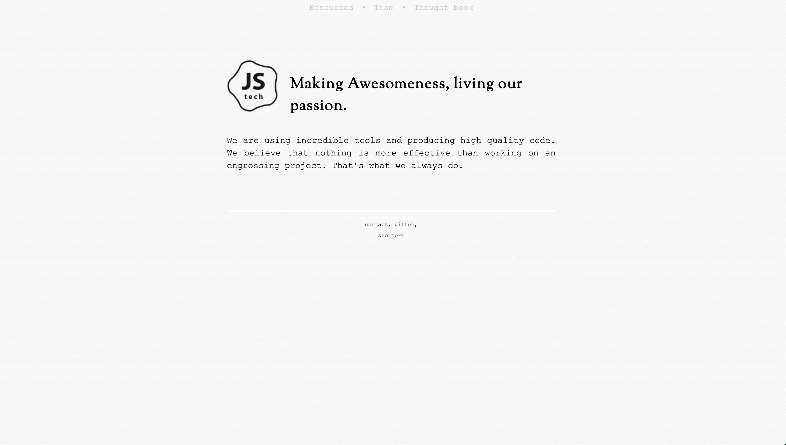
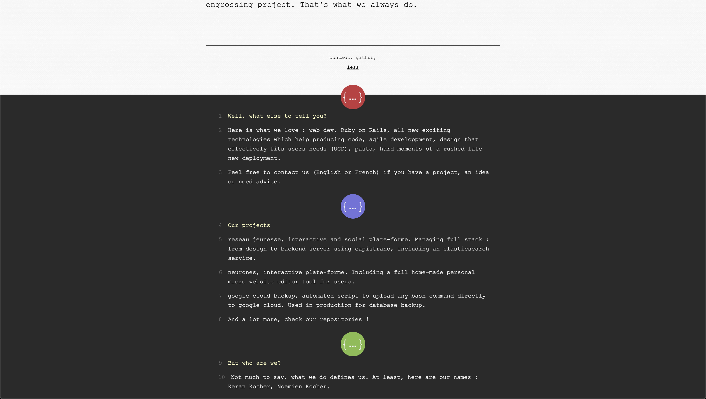
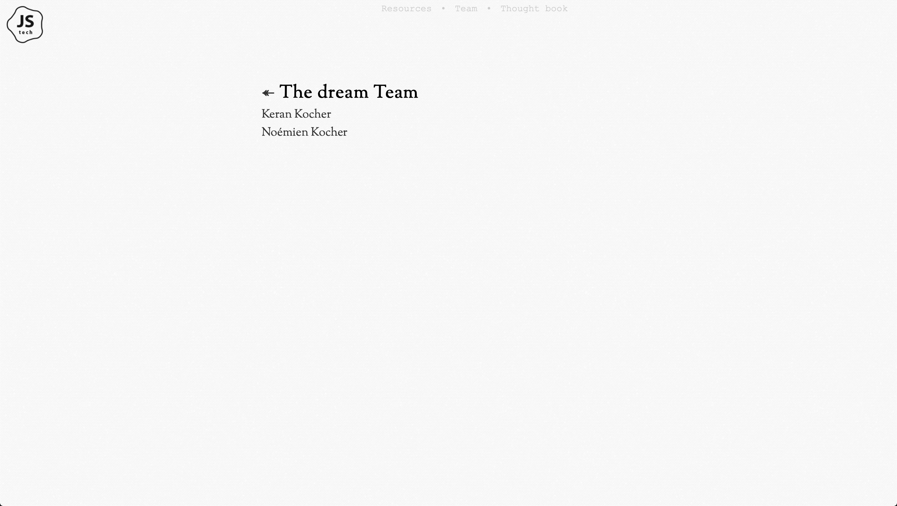
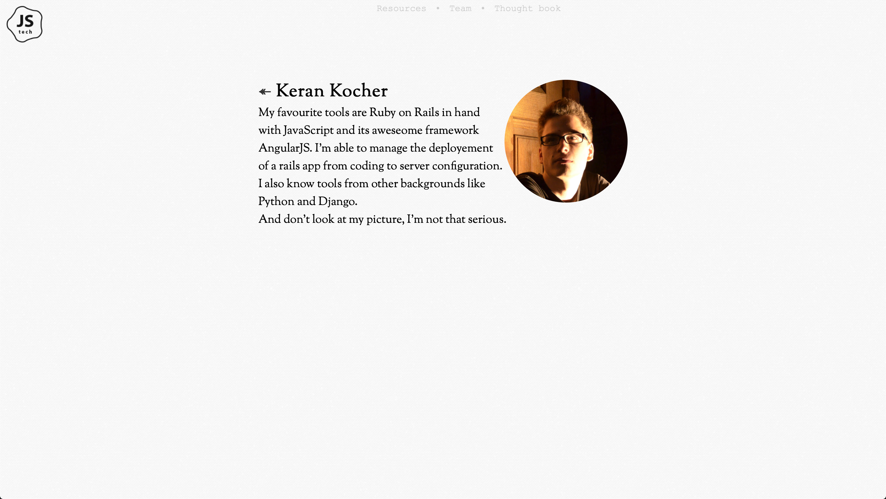
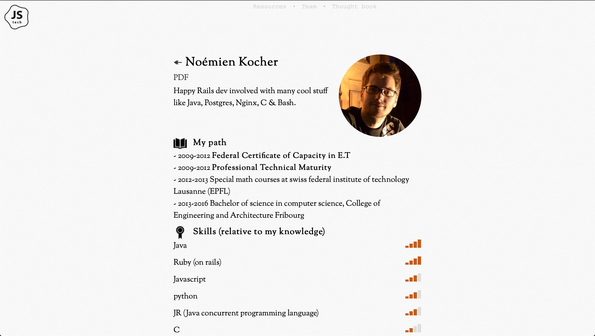
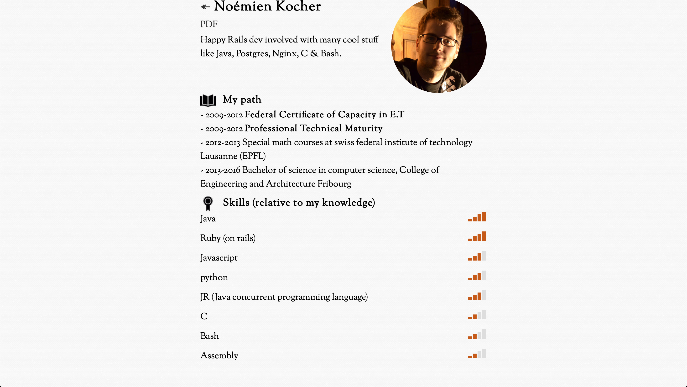
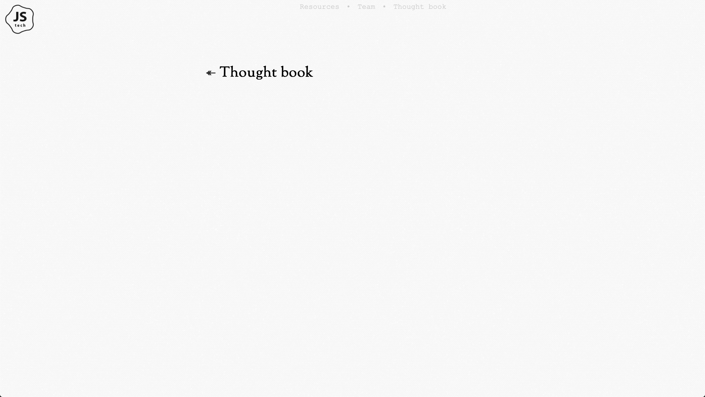

# End of life

This website is dead, we release him from his duties. Thank you jstech.ch 🧡









 ---

Thanks to https://coderwall.com/p/ttrhow/deploying-rails-app-using-nginx-puma-and-capistrano-3

dependencie :

```
dpkg -i wkhtmltopdf.deb
sudo apt-get -f install
```
